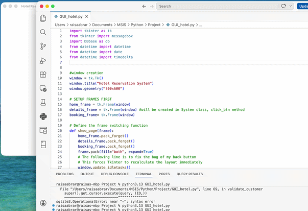
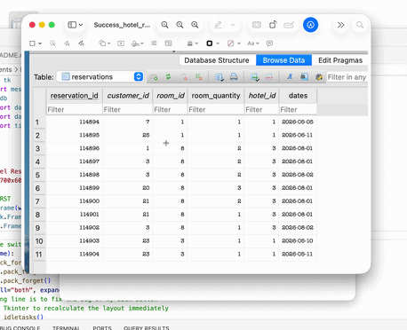
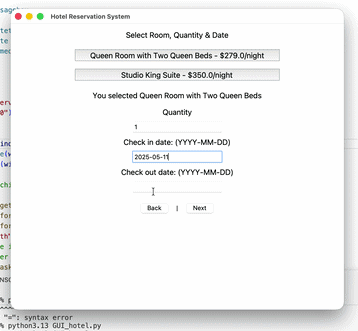
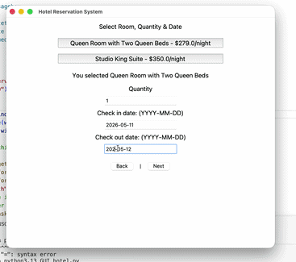

# 🏨 Hotel Reservation System

A desktop management suite built in Python that handles multi-hotel bookings, room availability tracking, and customer records using a relational SQLite database.

---

## 📸 Demo

### 🛠️ Edge Case Handling & Logic
<details>
  <summary><b>View: Overbooking Prevention Demo</b></summary>
  <p>The system checks every date in the requested range and blocks the booking if any single day is at capacity.</p>
  
</details>

<details>
  <summary><b>View: Input Validation Demo</b></summary>
  <p>Prevents past-date check-ins </p>
  
</details>

<details>
  <summary><b>View: Input Validation Demo</b></summary>
  <p>Prevents check-out date before check-in date </p>
  
</details>


## 🚀 Key Features
- **Dynamic Hotel Management**: Supports multiple properties, each with unique room types and pricing.
- **Smart Availability Logic**: Calculates real-time room stock across date ranges to prevent overbooking.
- **Relational Database**: A 4-table normalized schema (Hotels, Rooms, Customers, Reservations) ensures data integrity.
- **Bulk Data Ingestion**: Built-in support for importing customer records from **CSV files**.
- **Input Validation**: Integrated error handling for past-date bookings and invalid ID entries.

## 🛠️ Tech Stack
- **Language**: Python 3.13
- **GUI Framework**: Tkinter (Standard Library)
- **Database**: SQLite3
- **Tools**: datetime, csv, messagebox

## 🏗️ Technical Implementation
This project demonstrates several professional software engineering principles:
- **Object Oriented Design**: Utilizes a base DBbase class to abstract database connections, promoting code reuse across the application.
- **Transactional Integrity**: Implements a "Check-then-Commit" phase for reservations; no data is written until all requested dates are verified as available.
- **Safe SQL Queries**: Uses **parameterized queries** throughout to protect against SQL Injection.
- **State Management**: Manages complex GUI state transitions (Home -> Details -> Booking) within a single-window Tkinter application.


## 💻 Installation and Usage
To view the code in action or run it locally:

1. **Clone the repo**:
   ```bash
   git clone https://github.com/rabrar-code/HotelReservation
   ```
2. **Initialize the Database**:
   Code to generate hotel_reservation.sqlite.
   ```bash
   python hotel_project.py
   ```

3. **Run the App**:
   ```bash
   python GUI_hotel.py
   ```

### 🍎 Note for macOS Users
This application requires **Python 3.13** on macOS to ensure proper compatibility with the **Tkinter** framework. Standard macOS Python versions may experience GUI rendering issues.

1.  **Check your Python version**:
    ```bash
    python3 --version
    ```
2.  **Run the scripts using Python 3.13**:
    *   **Setup Database**: `python3.13 hotel_project.py`
    *   **Launch App**: `python3.13 GUI_hotel.py`

*Note: For Windows/Linux, any standard Python 3.10+ installation should work as expected.*

---
*Created by Raisa Abrar - www.linkedin.com/in/raisa-abrar-62450646*
